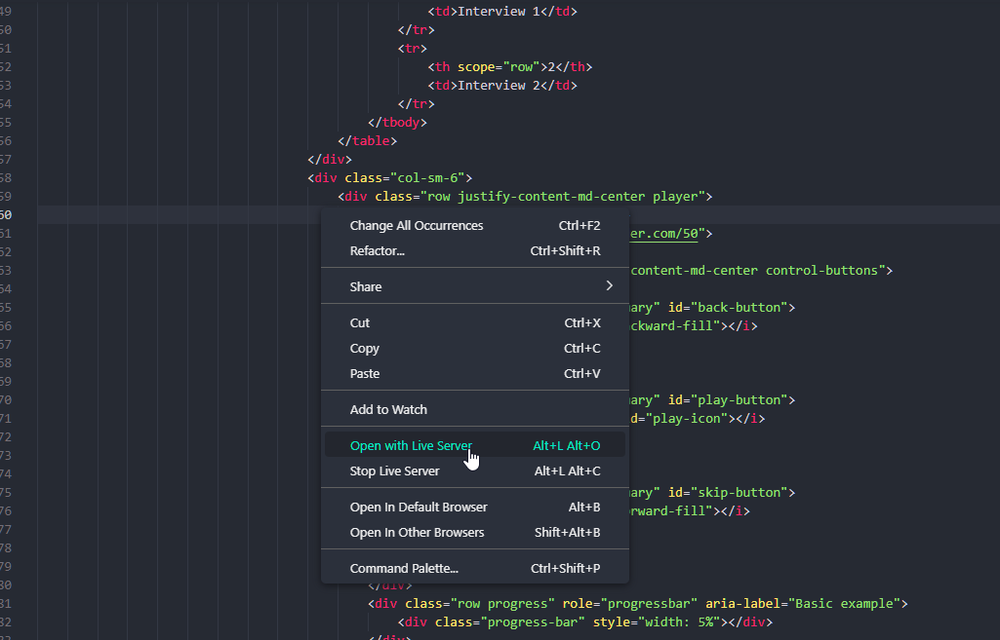
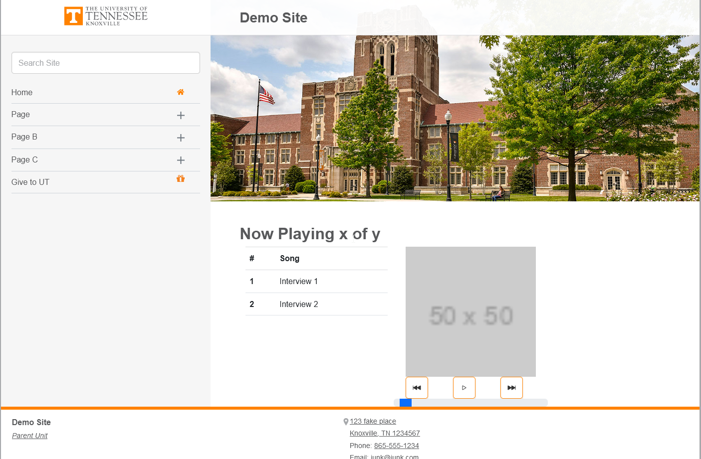

# Demo Audio Player

  ## About/Description

  This repo is meant as a demo project for the audio player for an interview. 

  ## Table of Contents

  * [Installation](#installation)
  * [Usage](#usage)
  * [Languages](#languages)
  * [Contributing](#contributing)
  * [License](#license)
  * [Tests](#tests)
  * [Questions](#questions)
  
  ## Installation

  This application uses the VS Code extension live server.  This extension is turned on by right clicking on the index.html and selecting live server.  Without it, the template code used from the University of Tennesee will not work. 

  ## Usage

  ### Screenshots

  #### Opening project with Live Server Extension

  

  #### Site Example Screenshot

  

  ## Languages

  JavaScript HTML CSS

  ## Contributing

  Contributions by: David Shaw

  If you would like to contribute to this project we follow the [Contributor Covenant](https://www.contributor-covenant.org/)

  ## Questions:

  If you have any questions please contact us or refer to our github below:

  Email Us At: david.shaw1242@gmail.com

  Github Repo: https://github.com/ds1242/u-t-audioplayer 